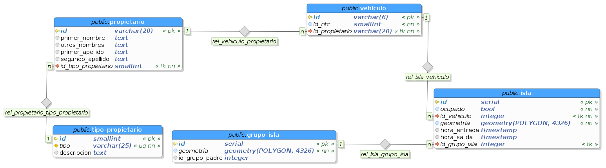

#Parqueaderos
Es el entorno de desarrollo para el sistema de parqueaderos. Esta se inicia a través de un entorno de Vagrant.

Para iniciar la máquina:
```bash
$ vagrant up
```

Se ejecuta la provisión:
```bash
$ vagrant provision
$ vagrant reload
$ vagrant ssh
```

¿MÁS FÁCIL?
-----------
```bash
$ ./install
```

INICIAR
-------
```bash
$ ./run
```

OTRAS OPCIONES
--------------
```bash
$ ./run --help
```

MODELO
------

